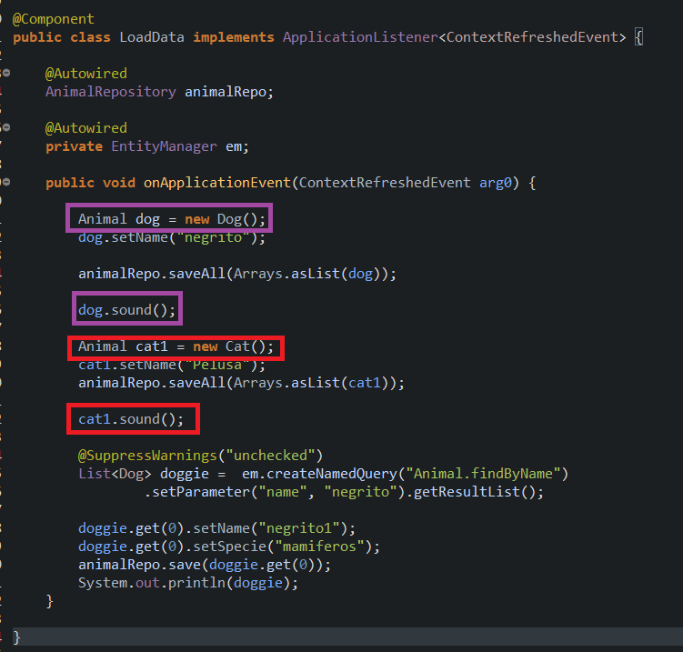
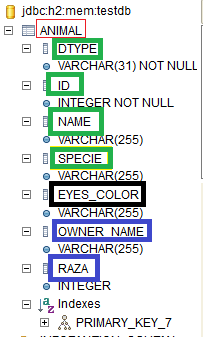

# PolimorphismExample
Example of polimorphism in java SpringBoot

In this example we create a parent class "Animal.class" and two daughter classes "Dog.class" and "Cat.class"

To manage data, an interface is created for the animal class that extends from JPARepository, in this way all the necessary methods are generated for the insertion of the data related to the two daughter classes.

The use of <b>Polymorphism</b> is evidenced in the creation of the sound () method, in this case each class prints a different message when executing this method with an instance relative to the class on which the object is created.

The LoadData class exemplifies the handling of data related to the Cat and Dog classes.

In the way the model classes are defined, a class structure is created in the DB as follows

The ANIMAL table is generated, green rectangle for the parent class attributes, black rectangle for Cat child class attributes and blue rectangle for Dog child class attributes

 

